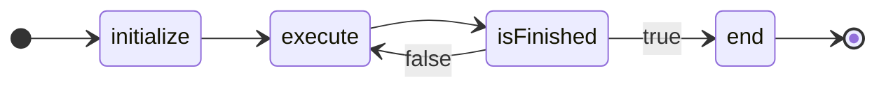
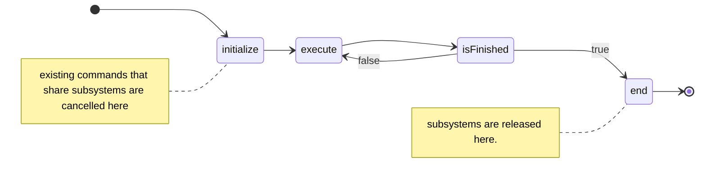

---
aliases:
  - Command
---

Requires:
[[Robot Code Basics]]
## Success Criteria
- [ ] Create a command that runs indefinitely
- [ ] Have that command start+end on a joystick button
- [ ] Create a command that starts on a joystick press, and stop it with a different button
- [ ] Create a default command that lets you know when it's running through [[Basic Telemetry|Telemetry]]
- [ ] Create a runCommand using a function pointer
- [ ] Create a runCommand using a lambda


> [!NOTE] Learning order
> You can learn this without having done [[Motor Control]], but it's often more fun to learn alongside it in order to have more interesting, visual commands while experimenting.
> The commands provided as an example just print little messages visible in the RioLog, allowing this to be set up without motors

## What is a command

A Command is an event driven code structure that allows you manage when code runs, what resources it uses, and when it ends. 

In the context of a robot, it allows you to easily manage a lot of the complexity involved with managing multiple [[Subsystems]] 

The code structure itself is fairly straightforward, and defines a few methods; Each method defines what code runs at what time. 
```java
class ExampleCommand extends CommandBase{
	public ExampleCommand(){}
	public void initialize(){}
	public void execute(){}
	public boolean isFinished(){ return false; }
	public void end(boolean cancelled){}
}
```

Behind the scenes, the robot runs a command scheduler, which helps manage what runs when. Once started, a command will run according to the following flowchart, more formally known as a [[State Machines|state machine]]. 



This is the surface level complexity, which sets you up for how to view, read, and write commands. 

## Requirements and resources

A key aspect of Commands is their ability to claim temporary, exclusive  ownership over a [[Subsystem]] .  This is done by passing the subsystem into a command, and then adding it as a requirementcontroll
```java
class ExampleCommand extends CommandBase{
	public ExampleCommand(ExampleSubsystem subsystemName){
		addRequirements(subsystemName);
	}
```

Now, whenever the command is started, it will forcibly claim that subsystem. It'll release that claim when it runs it's end() block.

This ability of subsystems to hold a claim on a resource has a lot of utility. The main value is in preventing you from doing silly things like trying to tell a motor to go forward _and_ backward at once.


## Events and interruptions

Now that we've established subsystem ownership, what happens when you *do* try to tell your motor to go forward and then backward?

When you start the command, it will forcibly interrupt other commands that share a resource with it, ensuring that the new command has exclusive access. 

It'll look like this


When a command is cancelled, the command scheduler runs the commands `end(cancelled)` block, passing in a value of true. Whole not typical, *some* commands will need to do different cleanup routines depending on whether they exited on a task completion, or if something else kicks em off a subsystem. 

## Starting and Stopping Commands

Commands can be started in one of 3 ways:
- via a [[Triggers|Trigger]]'s start condition
- Directly scheduling it via the command's `.schedule()` method.
- Automatically as a DefaultCommand

They can be stopped via a few methods
- When the command returns `true` from it's isFinished() method
- When launched by a [[Triggers|Trigger]], and the run condition is no longer met
- Calling a command's `.cancel()` method directly
- When the command is cancelled by a new command that claims a required subsystem.
## Default Commands

It's often the case that a subsystem will have a clear, preferred action when nothing else is going on. In some cases, it's stopping a spinning roller, intake, or shooter. In others it's retracting an intake. Maybe you want your lights to do a nice idle pattern. Maybe you want your chassis joystick to just start when the robot does.

Default commands are ideal for this. Default commands run just like normal commands, but are automatically re-started once nothing else requires the associated subsystem resource.

Just like normal command, they're automatically stopped when the robot is disable, and cancelled when something else requires it. 
Unlike normal commands, it's _not_ allowed to have the command return true from `isFinished()`. The scheduler expects default commands to run until they're cancelled. 

Also unlike other commands, a subsystem _must_ require the associated subsystem, and _cannot_ require other subsystems. 

> [!CAUTION] Command groups + default commands
> It's worth making a note that a Default Command cannot start during a Command Group that contains a command requiring the subsystem! If you're planning complex command sequences like an auto, make sure they don't rely on DefaultCommands as part of their operation.


## When to require

As you're writing new subsystems, make sure you consider whether you *should* require a subsystem. 

You'll always want to require subsystems that you will modify, or otherwise need exclusive access to. This commonly involves commands that direct a motor, change settings, or something of that sort. 

In some cases, you'll have a subsystem that _only_ reads from a subsystem. Maybe you have an LED subsystem, and want to change lights according to an Elevator subsystems's height. 
One way to do this is have a command that requires the LEDs (needs to change the lights), but does not require the Elevator (it's just reading the encoder).

As a general rule, most commands you write will simply require exactly one subsystem. Commands that need to require multiple subsystems can come up, but typically this is handled by command composition and command groups.
## External Commands

Every new project will have an example command in a dedicated file, which should look familiar
```java
class ExampleCommand extends CommandBase{
	public ExampleCommand(){
		//Runs once when the command is created as the robot boots up.
		//Register required subsystems, if appropriate
		//addRequirements(subsystem1, subsystem2...);
	}
	public void initialize(){
		//Runs once when the command is started/scheduled
	}
	public void execute(){
		//Runs every code loop
	}
	public boolean isFinished(){
		//Returns true if the command considers it's task done, and should exit
		return false;
	}
	public void end(boolean cancelled){
		//Perform cleanup; Can do different things if it's cancelled
	}
}
```
This form of command is mostly good for instructional purposes while you're getting started. 

On more complex robot projects, trying to use the file-based Commands forces a lot of mess in your Subsystems; In order for these to work, you need to make many of your Subsystem details public, often requiring you to make a bunch of extra functions to support them. 

## Command Factories

Command factories are the optimal way to manage your commands. With this convention, you don't create a separate  Command files, but create methods in your [[Subsystems|Subsystem]] that build and return new Command objects. This convention is commonly called a "Factory" pattern. 
Here's a short example and reference layout:

```java
//In your subsystem
Roller extends SubsystemBase{
	Roller(){}

	public Command spinForward(){
		return Commands.run(()->{
			System.out.println("Spin Forward!!");
		},this);
	}
}
```

```java 
//In your robotContainer.java, let's create a copy of that command
RobotContainer{
	RobotContainer(){
		joystick.a().whileTrue(roller.spinForward());
	}
}

```
That's it! Not a lot of code, but gives you a flexible base to start with.

This example uses `Commands.run()` one of the many options in the [Commands Class](https://github.wpilib.org/allwpilib/docs/release/java/edu/wpi/first/wpilibj2/command/Commands.html). These command shortcuts let you provide [[Lambdas]] representing some combination of a Command's normal Initialize, Execute, isFinished, or End functions. A couple notable examples are

- Commands.run : Takes a single lambda for the Execute blocks
- Commands.startRun : Takes two lambdas for the Initialize and Execute blocks
- Commands.startEnd : Takes two lambdas for the Initialize and End Blocks

Most commands you'll write can be written like this, making for simple and concise subsystems. 

> [!BUG] Watch the Requires
> Many `Commands` helpers require you to provide the required subsystem after the lambdas. If you forget, you can end up with multiple commands fighting to modify the current subsystem

Building on the above, Subsystems have several of these command helpers build in! You can see `this.startRun(...)`, `this.run(..)` etc; These commands work the same as the `Commands.` versions, but automatically `require` the current subsystem.

There's a notable special case in `new FunctionalCommand(...)`, which takes 4 lambdas for a full command, perfectly suitable for those odd use cases.

## Command Composition 

The real power of commands comes from the [Command Compositions](https://docs.wpilib.org/en/stable/docs/software/commandbased/command-compositions.html) , and "decorator" functions. These functions enable a lot of power, allowing you to change how/when commands run, and pairing them with other commands for complex sequencing and autos. 

For now, let's focus on the two that are more immediately useful: 
- `command.withTimeout(time)` , which runs a command for a set duration. 
- `command.until(()->someCondition)` , which allows you to exit a command on things like sensor inputs. 

Commands also has some helpful commands for hooking multiple commands together as well. The most useful is a simple sequence.
```java
Commands.sequence(
	roller.spinForward().withTimeout(0.1),
	roller.spinBackward().withTimeout(0.1),
	roller.spinForward().withTimeout(0.5)
)
```

For  simple sequencing you can also use the `command.andThen(otherCommand)` decorator.


One of the most powerful is the Parallel compositor. This allows you to drive multiple subsystems at once. This example would spin rollers, move an elevator, and set your lighting color simultaneous.
```java
Commands.parallel(
	roller.spinForward(),
	elevator.setHeight(27),
	leds.setColor(Color.Red)
).until(elevator.isAtSetpoint())
```

There's multiple variants of this, which allow various "exit conditions" for existing commands, but a simple `parallel` with an explicit exit condition tends to be the easiest.

## Example Command Composition

For this example, let's assume we have a shooter, consisting of 
- A Pivot to control aiming
- Flywheels, which handle the shooting RPM
- a Feeder that can push a held game piece into the flywheels
Mechanically, our sequence should then be 
- Spin up our shooter and aim
- Once we're spun up, feed the game piece into the shooter
- Spin down and put our shooter back at a rest position

```java
RobotContainer{
	//Pretend these all work as expected!
	Pivot pivot = new Pivot();
	Flywheel flywheel = new Flywheel();
	Feeder feeder = new Feeder();
	
	CommandJoystick joystick = new CommandJoystick(/*...*/)
	
	RobotContainer(){	
		joystick.a().whileTrueOnce(
			/* The command sequence is shown below for clarity */
		);
	}
	
}
```


```java
// This would go in the spot indicated above
Commands.sequence()
	//Spin up and wait til we're ready
	Commands.parallel(
		flywheel.setShootRPM(),
		pivot.setShootingAngle()
	)
	.until(
		pivot.isAtShootingPosition())
		.and( flywheels.isAtShootingRPM() 
	),

	//Keep the shooter+pivot running, and feed it a game piece
	Commands.parallel(
		flywheel.setShootRPM(),
		pivot.setShootingAngle(),
		feeder.feedGamepieceIntoFlywheels()
	).withTimeout(1),

	//Set everything down. 
	Commands.parallel(
		flywheel.stop(),
		pivot.setAngleToResting(),
		feeder.stop()
	).pivot.isAtShootingPosition()
)
```

These kinds of commands are very powerful, but can get unweildy. 
When building complex sequences, consider using a [[Code Patterns#Factory Pattern|Factory Pattern]] to name and parameterize smaller, reusable snippets.


## Where all the commands? 

WPILib's docs document a few useful commands, but the full rundown is here: 

The ones are the "newer" formats; These are subsystem methods (and factories, so you won't see `new` when using them), and automatically include the subsystem for you. 
https://github.wpilib.org/allwpilib/docs/release/java/edu/wpi/first/wpilibj2/command/Commands.html

These ones are the older style;  They do the same things with different names, and don't include commands. In general, we'll avoid using these, but it's good to know about them for occasional corner cases.
https://github.wpilib.org/allwpilib/docs/release/java/edu/wpi/first/wpilibj2/command/Command.html

##  Best Practices

Now that you have some command knowledge, there's a few things to keep in mind to make using commands seamless and consistent.


#### Command-focused interactions

When interacting with subsystems, we *mostly* only care about the actual commands.

As a result, avoid getting caught in the trap of writing "functions" and then pulling those into commands, like this: 
```java
public exampleSubsystem extends SubsystemBase{
	public void runMotor(double power){ motor.set(power); }
	public Command runMotorCommand(){
		return run(this::runMotor);
	}
}
```
Doing generates more code, uses up good names, and can generate confusion about which one you want. It can also lead you to complicate the Function to do things that a Command is better at.

Instead, just go straight into building out command factories. 
```java
public exampleSubsystem extends SubsystemBase{
	public Command runMotor(double power){
		return run(()->motor.set(power) );
	}
}
```


#### Define Subsystem standards

Most subsystems will have a "Default Command" that handles the passive behavior, so it's not necessary for each individual command to deal with exit conditions. This greatly simplifies writing other commands, since they all get an implied `stop()` or `holdPosition()` when you're done! Your DefaultCommand is great as a "self care" operation when nothing else is going on.

There are exceptions though, and some commands might have multiple preferred "defaults" based on things like "are we holding a game piece". In such cases, your `defaultCommand` might have some additional logic, often using `ConditionalCommands`, `SelectCommand`, and the `.repeatedly()` decorator .

#### By default, subsystem Commands shouldn't exit!

When making your basic, simple commands, *do not* attach exit conditions. Doing so will significantly complicate typical usage. 

As an example, let's say your `intake.setAngle(...)` command extends an intake arm, then exits when reaching the target angle. Now, you put that into a button for your drivers. Well, it extends, then exits. This either leaves it in "uncommanded" (retaining the last provided motor value and likely just going downward), or lets the defaultCommand run (which probably pulls the intake back in!). What you want to happen is to actually maintain the command until the driver releases the button _or_ you intake a game piece. But.... it's unfortunately challenging to cancel the original exit behavior. It's easy to cut a process short; But much harder to make it go longer.

Instead, make base commands run forever, and create [[Triggers]] or Boolean functions that checks for common exit conditions  such as `isAtSetpoint()`; When you use your command, just use `.until(system::isAtSetpoint)` if appropriate.

Later, once you start making more complicated sequences, some of them might have no reasonable case where you'd want that sequence to exit; Such as "getGamePieceFromGroundAndRetractBackIntoRobot()" . This (verbosely named) hypothetical obviously doesn't need to keep going .

#### Start with basic building block functions

Often, you want to start with simple Commands that do simple things. A roller system might need an `intake()`, `stop()`, `eject()` , which just run forever, setting a motor speed. Arms might just have a `setAngle()` that PIDs to an angle. 

These are easy to test, and easy to work with in bigger, more complex sequences.


## A practical example
Putting it all together, let's take two subsystems: a roller attached to an arm, together working as an intake. Then fill in some simple commands.

```java
public ExampleIntake extends SubsystemBase{
	//motor created here
	ExampleIntake(){ //constructor
		//configure motor here
		setDefaultCommand(defaultCommand());
	}
	public Command intake(){
		return run(()->motor.run(.5) );
	}
	public Command stop(){
		return run(()->motor.run(0) );
	}
	public boolean isGamepieceLoaded(){
		return sensor.read()==false;
	}
	public Command defaultCommand(){
		return either(
			()->motor.run(.1),
			this::stop,
			this::isGamepieceLoaded
		);
	}
}
```

```java
public ExampleArm extends SubsystemBase{
	//motor created here
	ExampleArm(){//constructor
		//configure motor here
		setDefaultCommand(()->setArmAngle(90));
	}
	public boolean isAtTargetAngle(){
		return /*out of scope for now*/;
	}
	public Command setArmAngle(double angle){
		return run(()->motor.getPIDController().setReference(angle,/*...*/) );
	}
}
```

```java
public RobotContainer{
	//joystick and subsystem creation would go here
	RobotContainer(){
		joystick.a().whileHeld(grabGamepieceFromFloor());
	}
	public Command grabGamepieceFromFloor(){
		return new SequentialCommandGroup(
			new ParallelCommandGroup(
				intake.intake(),
				arm.setArmAngle(20)
			).until(intake::isGamepieceLoaded),
			new ParallelCommandGroup(
				intake.intake(),
				arm.setArmAngle(90)
			).until(arm::isAtTargetAngle)
		)
	}
}
```

Here you can see all this come together: 
- We have a couple simple named commands for our rollers. 
- We have a more complex one that sets an arm position using a [[PID]]
- We have a couple boolean conditions we can check for potential system states
-  We have a composite sequence that does a full, complete task. It uses different exit conditions, from different subsystems.
- And, we have a smart defaultCommand that does something different when loaded vs unloaded, so none of our other commands have to deal with it. The intake handles it for us.
