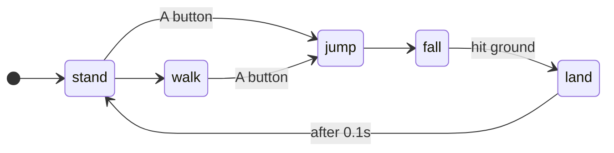

---
tags:
  - stub
---

Requires:
[[Sensing Basics]]
## Success Criteria
- [ ] ??? ^b1bae4
- [ ] Covering system "state" is very useful, especially in subsystems
- [ ] ConditionalCommand + SelectCommand can be useful for attributing actions and states on simple systems

- [ ] Need to find a sensible formal way to cover it; It's easy to make "custom" state machines for simple systems, but hard to scale up in complexity with consistent patterns.

#### Possible state model
  - States of Unloaded, unaligned, loaded, scoring

Consideration: Explain state machines here, as an explanation of how they're used and what they represent

Actually make it a workshop later.

#### Example: Jumping Character

This example demonstrates a small video game character and how you might handle their Jump logic

