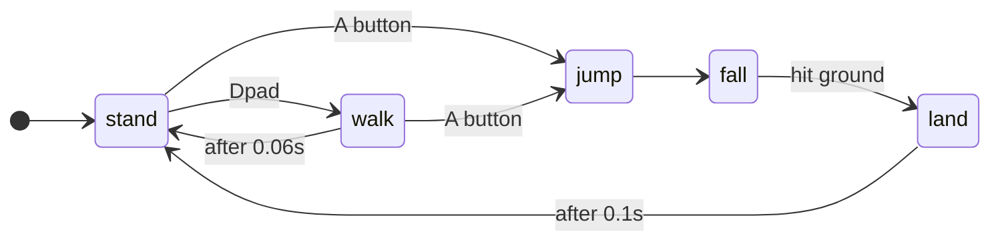
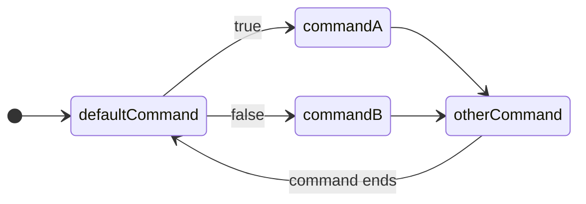

---
tags:
  - stub
---

Requires:
[[Sensing Basics]]
## Success Criteria
- [ ] ??? ^b1bae4
- [ ] Covering system "state" is very useful, especially in subsystems
- [ ] ConditionalCommand + SelectCommand can be useful for attributing actions and states on simple systems

- [ ] Need to find a sensible formal way to cover it; It's easy to make "custom" state machines for simple systems, but hard to scale up in complexity with consistent patterns.

## Synopsis

In many complex applications, we track "state" representing a particular configuration of input, output, and logic conditions. 

A state machine is a method of managing transitions between independent states, and applying output depending on the states.

## State

A "state" represents a particular system response, and is typically defined by the outputs and logic being applied. For example, if we look at some states of a simple roller intake we might have 
- Intaking: The rollers are turned on
- Loaded: The rollers are turned off
- Unloaded: The rollers are turned off
- Ejecting: The rollers are turned on in reverse

The notable thing is that we have *two* states with the same response, but imply *very* different things about our system! One indicates that we have a game piece, and the other that we do not.
## State Transitions

Each state *also* contains some sort of transition logic, which dictates which states it can transition to, as well as what input conditions cause each of those transitions. 

Inputs can be anything: A button press, a sensor change, a timer, an analog input hitting a certain range, an output not reacting as expected, and more. On occasion you might transition states automatically *without* any input all to just add a one-off event between states.

This encapsulates the real power of state machines: Since the response to external responses is based on states, you can easily choose how to handle them under various conditions: You can ignore external inputs, change what the reaction looks like, or even transition automatically based on timers, counters, or other checks. 

## State Diagrams

When discussing State Machines, we normally model the whole system using a simple diagram. This allows us to easily see the transitions and states, stripping away all the underlying details (such as code and code structure).
#### Example: Jumping Character

This example demonstrates a small video game character and how you might handle their Jump logic




## Coding State Machines

State machines have a *very* wide variety of ways they can be implemented, and often you can stumble into making one without being conscious of it. 

Robots on the whole *are* state machines, and state machines power many underlying framework details, like the Enable/Teleop/Practice modes, [[Commands]], and more! 

There's often no "right way" to make these, but you should generally consider
- Readability : How easy is it to look for a particular state or transition's logic and then find it 
- Maintainability: How easy is it to fix a bug without adding new bugs
- Extensibility: How easy is it to add additional states and transitions

### Simple State Machine

The easiest state machine in FRC code is just using `Commands.either()` `or ConditionalCommand` as a subsystem Default Command. 



This is implemented  as follows
```java
ExampleSubsystem extends SubsystemBase{
	DigitalInput sensor = new DigitalInput(0); //Some simple sensor
	ExampleSubsystem(){
		addDefaultCommand( defaultCommand() );
	}
	
	public Command defaultCommand(){
		return Commands.either(
			commandA(),
			commandB(),
			isSensorActuated
		);
	}
	
	public Trigger isSensorActuated = new Trigger(()->sensor.get()==true);
	public Command commandA(){ return run(); }
	public Command commandB(){ return run(); }
	// Any other command which requires the subsystem
	// serves as this "state"
	public Command otherCommand(){ return run(); }
}
```

This has a somewhat implicit behavior through our normal [[Subsystems|Subsystem]] +[[Commands]] requirements system, and thus does not enforce any transitions between the two defaultCommands and any *other* command. However, this is still very useful! 

This particular setup is relatively common for handling game piece detection in a subsystem: Often you want to just power down a subsystem when the system is not loaded, but when it is loaded you might need to do something more active, such as applying some power to keep a game piece from shifting.

Note that this particular notation is very readable and maintainable, but *not* very extensible! Commands.either() allows only two state transitions, and thus effectively two controlled transitions.

### Managing Multiple States

See official docs: [Command Compositions](https://docs.wpilib.org/en/stable/docs/software/commandbased/command-compositions.html#selecting-compositions)

> [!TIP] Caution needed! 
> For *really* complex state machines, it's easy to generate extremely unwieldy code. 
> This is especially true with the number of possible inputs in FRC (via buttons, sensors, and timers), the scope of involved sensors, and number of  individual monitored systems and sub-state machines, and the needs of drivers to send the state machine to arbitrary states from other arbitrary states. 
> Make sure to plan your state diagram in advance, and prepare as best as possible for the level of complexity you need, and set up abstractions before you get caught in a messy [[Refactoring|Refactor]]


For more advanced state machines, consider the step up to `Commands.select`, which allows arbitrary states numbers of states. This encourages a common idiom for creating State Machines:
- Defining the actual states as smaller, independent blocks of code or data
- Defining a smaller block of code managing state transition logic
- Defining a selector that manages updating and initializing the state machine.
This separation of concerns generally yields a more readable, maintainable, and updatable structure. 

In FRC Java, this example code sets up such a system

```java
public class ExampleSubsystem extends SubsystemBase {
	//Here we provide the names of our states
	//These should be named in a more meaningful way on a real bot
	public enum State{a,b,c};
	State state=State.a;
	
	// This defines our state transition checks.
	public State selector(){
		//perform selection and transition logic here
		var sensor = Math.random(); //Changing input to replace a real sensor
		switch(state){
		case a:
			if(sensor<0.95){ state=State.b; }
		break;
		case b:
			if(sensor>0.99){ state=State.a; }
			if(sensor<0.01){ state=State.c; }
		break;
		case c:
			if(sensor<0.05){ state=State.b; }
		break;
		}
		this.state = state;
		return state;
	}

  /** Creates a new ExampleSubsystem. */
  public ExampleSubsystem() {
	//Connect our state output logic to the provided named states.
    Map<State,Command> stateMap = Map.ofEntries(
      Map.entry(State.a, new PrintCommand("Command a was selected!")),
      Map.entry(State.b, new PrintCommand("Command b was selected!")),
      Map.entry(State.c, new PrintCommand("Command c was selected!"))
    );
    
    //Scheduling it as a DefaultCommand ensures runs the selector every loop,
    //
    Command defaultCommand=Commands.select(map, this::selector);
    addDefaultCommand(defaultCommand);
	}
}
```

This helps manage more states: Our system can now select between many different actions, and our selector allows us to switch states based on the state of one or more inputs!

However, note that we have to *individually* code each state transition: This means as we increase the number of state transitions, states, and inputs, our transition logic can get very complicated.

We also don't have an effective way to manage "completion" of a transition: You're in state A or state B. If it's necessary to wait for the completion of a transition, you must model this as a state! So instead of the the above code that's expressed as
```java
	public enum State{a,b,c};
	///....
	Map<State,Command> stateMap = Map.ofEntries(
      Map.entry(State.a, commandForA()),
      Map.entry(State.b, commandForB()),
      Map.entry(State.c, commandForC())
    );
```
You have to extend this out even further, to 
```java
	//Revise our state to include transitions
	public enum State{a,b,c, to_a,to_b,to_c};
	/// Revise our state map with redundant commands
	Map<State,Command> stateMap = Map.ofEntries(
		Map.entry(State.a, commandForA()),
		Map.entry(State.b, commandForB()),
		Map.entry(State.c, commandForC()),
		Map.entry(State.to_a, commandForA()),
		Map.entry(State.to_b, commandForB()),
		Map.entry(State.to_c, commandForC())
    );
    // ... and our selector logic similarly gets more complex
	case a:
		if(/*change condition*/){ state=State.to_b; }
	break;
	case to_b:
		if(/*we've completed the transition*/){ state=State.b; }
	break;
```

This limitation means that it's best used for simpler state machines, with a limited number of time-sensitive transitions. 

### Complex State Machines 

> [!TIP] Topic of team research
> For extremely complex state machines, we're currently developing a state machine framework to facilitate a normal [[Commands|Command]] based robot and integrate it into increasingly complex state machines. If you find yourself here, let's give this a test!

See here for development:  https://github.com/stormbots/FSMControllerTesting

To handle more complex state machines, we're currently building a framework with the design goals of 
- Capable of providing readable, extensible, and upgradable code for a multi-system robot superstructure.
- Use  a Command/Trigger interface, allowing easy interaction with existing Command structures and Subsystem design standards
- Automatically handle slow transitions + transition completion
- Automatically handle traversal through complex state graphs
- Allow easy setup of controlled state transitions
- Work seamlessly with standard button bindings for controller setup.
- Accept automatic state transitions via Triggers
- Provide an API suitable for integrating into standard Command composition and sequencing.
- Nestable/hierarchical, such that a larger FSM can manage one or more smaller FSMs


