## Goals
Understand the typical Git operations most helpful for day-to-day programming

## Completion Requirements
This module is intended to be completed alongside other tasks: Learning Git is best done by doing, and doing requires having code to commit.

- [ ] Read through the [[#Git Fundamentals]] section
- [ ] Initialize a git repository in your project
- [ ] Create an initial commit
- [ ] Create several commits representing simple milestones in your project
- [ ] When moving to a new skill card, create a new branch to represent it. Create as many commits on the new branch as necessary to track your work for this card. 
- [ ] When working on a skill card that does _not_ rely on the previous branch, switch to your `main` branch, and create a new branch to  represent that card.
- [ ] On completion of that card (or card sequence), merge the results of both branches back into Main.
- [ ] Upon resolving the merge, ensure both features work as intended.

## Topic Summary
- Understanding git
- workspace, staging, remotes
- fetching
- Branches + commits
- Pushing and pulling
- Switching branches
- Merging
- Merge conflicts and resolution
- Terminals vs integrated UI tools


## Git Fundamentals

Git is a "source control" tool intended to help you manage source code and other text data.

Git has a lot of utility, but the core concept is that git allows you to easily capture your files at a specific point in time. This allows you to see how your code changes over time, do some time travel to see how it used to look, or just see what stuff you've added since your last snapshot.

Git does this by specifically managing the changes to your code, known as "commits". These build on each other, forming a chain from the start of project to the current code. 

At the simplest, your project's history something like the following

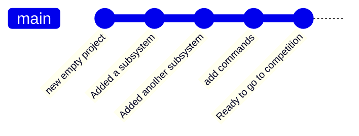

Git is very powerful and flexible, but don't be intimidated! The most valuable parts of git are hidden behind just a few simple commands, and the complicated parts you'll rarely run into. Bug understanding how it works in concept lets you leverage it's value better.

#### Diffs

Fundamental to Git is the concept of a "difference", or a diff for short. Rather than just duplicating your entire project each time you want to make a commit snapshot, Git actually just keeps track of only what you've _changed_.

In a simplified view, updating this simple subsystem
```java
/**Example class that does a thing*/
class ExampleSubsystem extends SubsystemBase{
	private SparkMax motor = new SparkMax(1);
	ExampleSubsystem(){}
	public void runMotor(){
		motor.run(1);
	}
	public void stop(){/*bat country*/}
	public void go(){/*fish*/}
	public void reverse(){/*shows uno card*/}
}
```
to this
```java
/**Example class that does a thing*/
class ExampleSubsystem extends SubsystemBase{
	private SparkMax motor = new SparkMax(1);
	private Encoder encoder = new Encoder();
	ExampleSubsystem(){}
	public void runMotor(double power){
		motor.run(power);
	}
	public void stop(){/*bat country*/}
	public void go(){/*fish*/}
	public void reverse(){/*shows uno card*/}
}
```
would be stored in Git as 
```diff
class ExampleSubsystem extends SubsystemBase{
	private SparkMax motor = new SparkMax(1);
+	private Encoder encoder = new Encoder();
	ExampleSubsystem(){}
-	public void runMotor(1){
-		motor.run(1);
+	public void runMotor(double power){
+		motor.run(power);
	}
	public void stop(){/*bat country*/}
```

With this difference, the changes we made are a bit more obvious. We can see precisely _what_ we changed, and _where_ we changed it.
We also see that some stuff is missing in our diff: the first comment is gone, and we don't see go(), reverse() or our closing brace. Those didn't change, so we don't need them in the commit. 

However, there are some unchanged lines, near the changed lines. Git refers to these as "context". These help Git figure out what to do in some complex operations later. It's also helpful for us humans just taking a casual peek at things. As the name implies, it helps you figure out the context of that change.

We also see something interesting: When we "change" a line, Git actually 
- Marks it as deleted
- adds a new line that's almost the same
Simply put, just removing a line and then adding the new one is just easier most of the time. However, some tools detect this, and will bold or highlight the specific bits of the line that changed.

When dealing with whole files, it's basically the same! The "change" is the addition of the file contents, or a line-by-line deletion of them!
### Commits + Branches

Now that we have some changes in place, we want to "Commit" that change to Git, adding it to our project's history. 

A commit in git is a just a collection of smaller changes, along with some extra data for keeping track. The most relevant is  
- A commit "hash", which is a unique key representing that specific change set
- The "parent" commit, which these changes are based on
- The actual changes + files they belong to.
- Date, time, and author information
- A short human readable "description" of the commit. 

These commits form a sequence, building on top from the earliest state of the project. We generally assign a name to these sequences, called "branches". 
 
A typical project starts on the "main" branch, after a few commits, you'll end up with a nice, simple history like this. 


It's worth noting that a branch really _is_ just a name that points to a commit, and is mostly a helpful book-keeping feature. The commits and commit chain do all the heavy lifting. Basically anything you can do with a branch can be done with a commit's hash instead if you need to! 

### Multiple Branches + Switching

We're now starting to get into Git's superpowers. You're not limited to _just_ one branch. You can create new branches, switch to them, and then commit, to create commit chains that look like this:
 
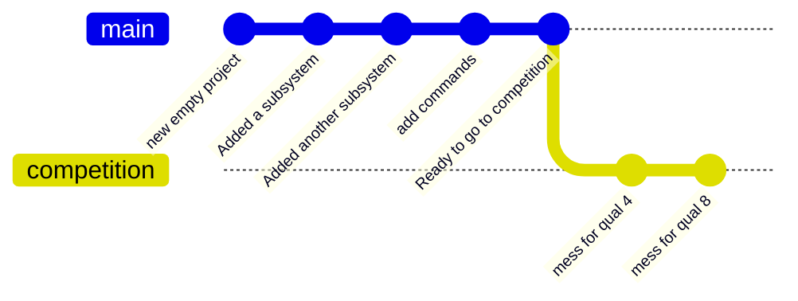

Here we can see that `mess for qual 4`  and `mess for qual 8`  are built off the `main` branch, but kept as part of the `competition` branch. This means our `main` branch is untouched. We can now switch back and forth using  `git switch main ` and `git switch competition` to access the different states of our codebase. 

We can, in fact, even continue working on `main` adding commits like normal. 

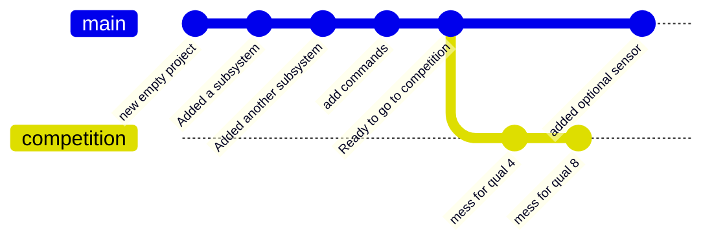
Being able to have multiple branches like this is a foundational part of how Git's utility, and a key detail of it's collaborative model. This is more traditionally referred to as a "git tree", since we can see it starts from a single trunk and then branches out into all these other branches.

However, you might notice the problem: We currently can access the changes in `competition` _or_ `main`, but not _both at once_.  

### Merging
Merging is what allows us to do that. It's helpful to think of merging the commits+changes from another branch into your current branch.

If we merge `competition` into `main`, we get this. Both changes ready to go! Now main can access the `competition` branch's changes. 

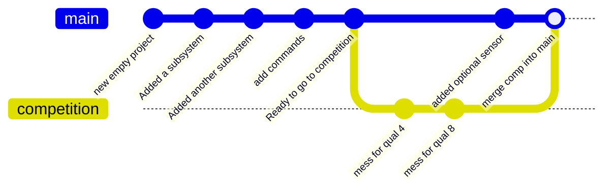

However, we can equally do `main` into `competition`, granting `competition` access to the changes from main. 
 
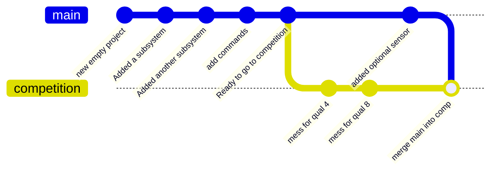

Now that merging is a tool, we have unlocked the true power of git. Any set of changes is built on top of each other, and we can grab changes without interrupting our _existing_ code and any other changes we've been making! 

This feature powers git's collaborative nature: You can pull in changes made by other people just as easily as you can your own. They just have to have the same parent _somewhere_ up the chain so git can figure out how to step through the sequence of changes.


### Workspace, Staging, and Commits

When managing changes, there's a couple places where they actually live. 

The most apparent one is your actual code visible on your computer, forming the "Workspace". As far as you're concerned, this is just the files in the directory, or as seen by VSCode. However, Git sees them as the end result of all changes committed in the current branch, plus any additional, uncommitted changes.

The next one is "staging": This is just the _next_ commit, but in an incomplete state. When setting up a commit, staging is where things are held in the meantime. Once you complete a commit, the staging area is cleared, and the changes are moved to a proper commit in your git tree.
Staging is not quite a commit, as the changes represented here can be easily over-written by staging new changes from your Workspace. But, it's not quite the workspace either, and doesn't automatically follow modifications to your code.
Because of this, Staging is *extremely* useful for code review! Staging a specific change is a great way to assert that that part is working and tested, even if you're not ready to make a commit yet.

In terms of our usual git tree, Staging and Workspace fit in right at the end, like so.
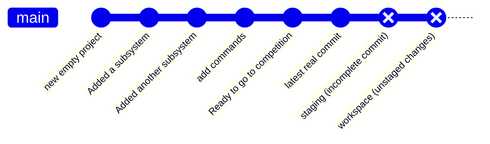

Lastly, is the actual commits that form your history. We generally won't deal with them individually, and instead just bundle them up in "branch". A branch is is just a helpful shorthand that names a specific commit, but in practice is used to refer to all prior changes leading up to that current commit.
### Remotes + Github

Git is a distributed system, and intentionally designed so that code can be split up and live in a lot of different places at once, but interact with each other in sensible ways for managing the code.

The most obvious place it lives is your computer. You have a full copy of the git tree, plus your own staging and workspace. This is often called the "local" repository.

Next is a "remote" repository, representing a remote git server. Often this is Github, using the default remote name of "origin".

The important consideration is that your computer operates totally independently of the remote unless you *intend* to interact with it! This means you can do almost any Git task offline, and don't even *need* a remote to make use of Git. 

Of course, being set up this way means that if you're not paying attention, you might not catch differences between Remote and Local git states. It's rarely an actual problem, but can be confusing and result in extra work. It's good practice to be aware of where your code is relative to origin, and make sure you push your code up to it  when appropriate.

When the origin is indicated specifically, you'll see it shown before the branch name: Main would go from `main` -> `origin/main`, like you see here in [[#Git from VSCode|Git Graph]], showing that we have 1 commit locally that doesn't exist on the origin. Or, we're ahead by one commit.

![[git-graph-commit-history.png]]


### Handling Merge Conflicts

Often when doing merges, you'll run into a "merge conflict", and some parts of your code get replaced with massive compiler errors and weird syntax. Don't panic! 

Merge conflicts happen when two branches change the same code. Git can't figure out what the "right answer" is, and so it needs a helping hand. To facilitate this, it has some special syntax so that you can see all information at a glance, but it's not always obvious that it's just being helpful! 

Let's look at the simplest possible merge conflict: Being in `main`, and merging `dessert`
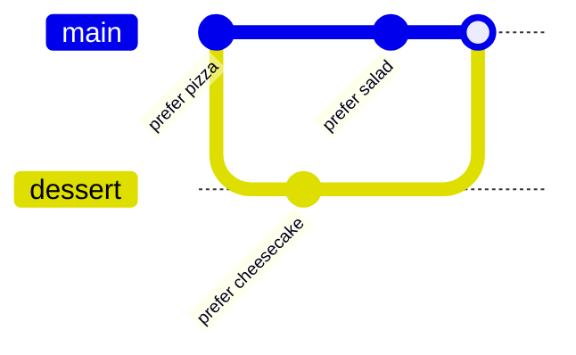
From an original file containing 
```diff 
Best food is pizza
```
The commit in `main` has the following change
```diff
-Best food is pizza
+Best food is salad
```
with `dessert` having this change
```diff
-Best food is pizza
+Best food is cheesecake
```

The merge is then making Git decide what's the optimal food. Git is *not* equipped for this debate, so it's up to us humans. Git prepares the file in question using "merge markers" around the issue, which provide some useful info to resolve it

```
<<<<<<< HEAD  
Best food is salad  
=======  
Best food is cheesecake  
>>>>>>> dessert
```

`<<<<<<< HEAD` -> indicates the start of a merge conflict. HEAD just means "last commit on current branch". Since we're on main, that means this code is just the result of following the code along the Main branch. VSCode will add additional information above this to help clarify.

`>>>>>>> dessert` -> is the end of merge conflict. `dessert` is the branch you're merging from; In other words, it's the result of following the proposed changes along the `cheesecake` branch. Again, VSCode will add additional info  to help. 

`=======` -> is the separator between the two branches'  code.

It's helpful to remember the goal of a merge: To put the two codebases together in a way that makes sense and is correct! So a merge conflict is resolved by making code that works, meaning there's several different ways to fix it!

One option is just accepting the change in your current branch, yielding
```
Best food is salad
```
This just means you've ignored the proposed change from the other branch (`dessert` in this case)

The other option is accept the incoming change, and ignore what your branch had.
```
Best food is cheesecake  
```

In some cases it's both! Maybe you're just fine with two best foods. 
```
Best food is salad
Best food is cheesecake  
```

Of course, you're after _correctness_. It's possible that after the update neither branch is quite right, and you have to adjust both.
```
Best side dish is salad
Best dessert is cheesecake  
```

Or, it could be neither! Maybe the right solution has become something else entirely. 
```
Best food is breakfast burritos
```

Most of the time, a merge conflict should be very easy to deal with if you know the parts of the code you're working with. 
Just move the code around until it works like both branches expected, then delete the merge marker, separator, and any unnecessary code, and you're good to go!

And, don't worry if you missed one! Git will spot these conflict markers if you try to commit one without sorting it out. 

If you get lost, ask for help! When dealing with code someone else wrote, you simply might not know what the best option is when coming out of it. That's fine! No tool can replace good communication.
### Handling Compile errors caused by merges

Merge conflicts aside, just because a merge *didn't* have a conflict, doesn't mean the code _works_. A sometimes surprising result stems from the fact that Git doesn't understand *code*, it just understands *changes*! 

The most likely reason you'll see this is someone changing a function name in one branch, while the other branch adds a new occurrence of it. Let's consider adding this code in our current branch

```diff 
@@ MainBranch: RobotContainer.java @@
   //filecontext
+  exampleSubsystem.callSomeFunction();
   //filecontext
```
and merging in this change from another branch.
```diff 
@@ CleanupBranch: ExampleSubsystem.java @@
   //filecontext
-  public void callSomeFunction(){
+  public void betterNamedFunction(){
   //filecontext
```

In this case, `main` doesn't know about the name change, and `CleanupBranch` doesn't know that you added a new call to it. This means `callSomeFunction()` no longer exists, leading to an error.

As with merge conflicts, it's up to you to figure out what's _correct_. In cases like this, you just want to adjust your new code to use the new name. But it sometimes happens that the other branch did something that needs to be changed back, such as deleting a function no one was using... until now you're using it.

Again, the purpose of the merge is to make it work! You're not done with a merge until everything works together as intended.

## The critical Git commands
A *lot* of Git's power boils down to just using the simple usage of a few basic commands. 


> [!TIP] Git via command line vs Graphical tools 
> While using the command line is optional, most good Git tools retain the name of these operations in graphical interfaces. After all, they're using the same operations behind the scenes. 
> Because of this, a bit of command line knowledge can help clarify what the more user-friendly tools are trying to do, and show you exactly why they're helpful. 

###### Creating a new repository
`git init` will creates a new git repository for your current project. It sets the "project root" as the current folder, so you'll want to double-check to make sure you're in the right spot! 

VSCode's built in terminal will default to the right folder, so generally if your code compiles, you should be in the right spot. Once the repository is created, git commands will work just fine from anywhere inside your project.
###### Getting Status
Knowing what your code is up to is step 1 of git. These commands

`git status` just prints out the current repo status, highlighting what files are staged, and what have unstaged changes, and where you are relative to your remote. If you've used other git commands, the effects will show up in `git status`. Run it all the time!


`git log` will open a small terminal dialogue walking you through changes in your branch (hit `q` to exit). However, it's often unhelpful; It contains a lot of data you don't care about, and is missing clarity on ones you do.

`git log --oneline` tends to be more helpful ; This just prints a one-line version of relevant commits, making it much more useful. 


###### Adding Changes to build a commit
`git add <files>` is all that's needed in most cases: This will add all changes present in a specific file. 

`git add <directories>` works too! This adds all changes below the specified folder path. Be mindful to not add stuff you don't *want* to commit though! Depending on the project and setup, you may or may not want to add all files this way.

`git add .`  is a special case you'll often see in git documentation; `.` is just a shorthand for "the current folder" . Most documentation uses this to indicate "Stage the entire project", and is mostly helpful for your very first commit. Afterwards, we'd recommend a more careful workflow.

`git reset <staged file/dir>` will will remove a file's changes from Staging and put them back in the Workspace ; Meaning, the change itself is preserved, but it won't be changed.  In practice, you probably won't  do this much, as it's easier to use a GUI for this. 

###### Confirming a commit

`git commit -m "describe changes here"` tends to be the beginner friendly approach. This makes a new commit with any staged changes.

`git commit` will usually open a small terminal editor called Vim with commit information and let you type a commit message. However, this editor is famous for it's "modal" interface, which is often surprising to work with at first. We'll generally avoid using it in favor of VSCode's commit tooling.


> [!TIP] Quick Vim tutorial
> If you get caught using the Vim editor for a commit, this is a quick rundown of the critical interaction.
`escape key`-> undo whatever command you're doing, and and exit any modes. Mash if you're panicking.
`i` -> When not in any mode, enter Insert mode (INSERT will be shown at the bottom). You can then type normally. Hit escape to go back to "command mode"
`:` -> start a command string; Letters following it are part of an editor command.
`:w` -> Run a write command (this saves your document)
`:q` -> Run a quit command (exit the file). This will throw an error if you have unsaved changes.
`:q!` -> The `!` will tell Vim to just ignore warnings and *leave*. This is also the "panic quit" option.
`:wq` -> Runs "save" and then "quit" using a single command
This means the typical interaction is `i` (to enter insert mode), type the message, `escape`, then `:wq` to save and quit. 
You can also abandon a commit by `escape` + `:q!`, since an empty commit message is not allowed by default. 


###### Creating Branches

`git branch NameOfNewBranch`: This just makes a new branch with the current name. Note, it does *not* switch to it! You'd want to do that before trying to do any commits!

Note, the parent node is the last commit of your current branch; This is not usually surprising if you're working solo, but for group projects you probably want to make sure your local branch is up to date with the remote!

###### Switching Branches

`git switch NameOfBranch`: This one's pretty simple! It switches to the target branch. 

`git switch --detach <commithash>` : This lets you see the code at a particular point in time. Sometimes this can be useful for diagnosing issues, or if you want to change where you're starting a new branch (maybe right before a merge or something). `--detach` just means you're not at the most recent commit of a branch. 

You might see `git checkout NameOfBranch` in some documentation; This is a common convention to "check out" a branch. However, the `git checkout` command can do a lot of *other* stuff too. For what we need, `git switch` tends to be less error prone.

> [!WARNING] Switching + uncommitted changes
> Note, Git will sometimes block you from changing branches! This happens if you have uncommitted changes that will conflict with the changes in the new branch. It's a special kind of merge conflict.
> Git has a number of tools to work around this, but generally, there's a few simpler options, depending on the code in question
> - Delete/undo the changes: This is a good option if the changes are inconsequential such as accidental whitespace changes, temporarily commented out code for testing, or "junk" changes. Just tidy up and get rid of stuff that shouldn't be there. 
> - Clean up and commit the changes: This is ideal if the changes belong to the current branch, and you just forgot them previously
> - "Work in progress" commit: If you can't delete something, and it's not ready for a proper commit, just create a commit with message beginning with  "WIP"; This way, it's clear to you and others that the work wasn't done, and to not use this code. 
> - use "git stash" the changes: This is git's "proper" resolution for this, but the workflow can be complicated, easy to mess up, and it's out of scope for this document. We won't use it often.

###### Merging code

`git merge otherBranchName` : This grabs the commits from another branch, and starts applying them to your current branch. Think of it as merging those changes into yours. If successful, it creates a merge commit for you.

`git merge otherBranchName --no-commit` : This does the merge, but doesn't automatically make a commit even when successful! This is often preferable, and makes checking and cleanup a bit easier. Once you've ran it, you can finish the commit in the usual way with `git commit`

`git merge --abort` is a useful tool too! If your merge is going wrong for whatever reason, this puts you  back to where you were before running it! 

`git merge` (note no branch name) merges in new commits on the same branch; This is useful for  collaborate projects, where someone else might update a branch. 
###### Keeping up to date with a Remote

`git fetch` connects to your remote (Github), and makes a local copy of everything the remote system has! This is one of the few commands that actually needs internet to function. 

Note, this *does not* change anything on your system. It does as the name implies, and just *fetches* it. Your local copies of branches remain at the commit you left them, so `git fetch` is always safe to run, and some tools run it automatically.
###### Pulling code from a remote + updating branches

`git pull` will contact the remote system, and apply changes from the remote branch to your local branch.

Behind the scenes, this is just running `git fetch` and then `git merge`. So, if you run git fetch and then try to work without internet, you can still get things done! Just use `git merge` with no branch name.

###### Pushing code to a remote
`git push` does this. By default it uses the same name, making this a short and simple one. 

> [!WARNING] Success not guaranteed
>  `git push` will fail if the push would cause a merge conflict on the remote system. This can happen if the remote branch has been modified since you branched off of it. 
>  If this happens, you'll need to update your repository with `git fetch` or  `git pull` , resolve the conflict, and try again

### Git from VSCode

Handling Git operations from VS Code is normally a very streamlined operation, and it has good interfaces to do otherwise tricky operations. 

#### Git Graph Plugin
This plugin provides some notable visualization tools that further improves Git handling in VS Code. We'll assume this is installed for the remainder of the tutorial here.
 https://marketplace.visualstudio.com/items?itemName=mhutchie.git-graph

Install that first!

#### Git Sidebar
The :luc_git_branch: icon on left side will open the git sidebar, which is the starting point for many git operations. 

Opening it will provide some at a glance stuff to review.

![[git-window+sidbar.png.png]]


We can see a lot of useful things:

At the top we can see any uncommitted changes, and the file they belong to. We'll deal with this when reviewing changes and making new commits. 
![[git-commit-interface.png]]


At the bottom (which might be folded down and labelled `> Outline` or `> Graph`), we can see our commit history for the current branch. The @main represents the current branch state, and :luc_cloud: icon represents the Origin (Github). If we're ahead or behind the origin, we can see it at a glance here.  

![[git-sidebar-commit-log.png.png]]

Note, we also see `main` at the very bottom; That's always there, giving us our current branch at a glance. 

#### Reviewing Changes + Making commits
The easiest way to review changes is through the Git Sidebar: Just click the file,and you'll see a split view. 

Changes will be shown in one of two ways. "Additions" are shown as a green highlight on the right side. On the left, you can see a `/////////////////` placeholder; This helps align the code so that you can easily keep track of where stuff gets inserted!

![[git-diffview-addition.png]]

Deletions look similar, but reversed. Left gets a red, right gets a placeholder. 
![[git-diffview-deletion.png.png]]

Changes to part of a line are either an addition and removal, or a small highlighted change of the particular bits. 

Note, you *can* actually type here! The right hand side is editable, allowing you to revise things if you see a change that's concerning. That side just represents the current state of the file in the workspace.
The left side is locked; This represents the prior state of the file, which can only be changed by adding more commits. 

You can approve/confirm changes in a couple ways. The easiest is to simply use the "Stage Changes" button by the filename in the sidebar; This stages all changes in a particular file.
![[git-sidebar-state-changes.png]]

In many cases, it's helpful to handle them one by one: If you right click on a change (or selected text that includes one or more changes), you'll see some options besides the normal text editing ones
![[git-diffview-rightclick-stage.png]]

As the name implies, you can Stage changes if you want them, Unstage them (if you want to remove it from the commit you're putting together). 
Note, you can also Revert it. In this case, reverting means that the change is *gone*! Added lines vanish, changed numbers go back to what they were, and reverting a deletion puts all the lines back! Be very careful here to not undo your work!

Note, that there's also a Revert/Discard Changes button too! Fortunately, this one checks with you. We'll rarely use it, but make sure to not hit it accidentally!
![[git-sidebar-discard-changes.png]]

Once we've staged some changes, we'll any staged changes separate from any unstaged changes

![[git-sidebar-staging-field.png]]
You can commit with un-staged changes just fine, just be mindful! We'll touch on best practices later. 

Once you've added all changes you want to include in the commit, just enter the message and click "Commit". Done! 

#### Remote interactions + VS Code

VS Code has some useful built in operations to `push` or `pull` branches! These will typically pop up automatically, with the helpful options being 
- `Push` -> Does a standard push
- `Pull` -> Does a standard pull
- `Publish Branch` -> This is a normal Push, but applies to newly created local branches. This normally requires a couple other small steps, which this handles automatically
- `Sync` -> Don't use this one!

> [!WARNING] The "Sync" button
> Be careful about the "Sync" button! Unlike other VSCode options, "Sync" will try to push *and* pull at the same time; However, in case of a merge conflict, it might try to resolve it using esoteric git operations behind the scenes. While this sometimes works, when something goes wrong fixing it properly is extremely challenging!
> In almost all cases, using a `git pull` , verifying the merge, and then a `git push` is a better workflow!


#### Viewing the git tree with Git Graph
We're now looking at the [Git Graph](https://marketplace.visualstudio.com/items?itemName=mhutchie.git-graph) specific stuff, so make sure that's installed!

There's two ways to launch it. One is using VS Code's Command Palette, activated by CTRL+Shift+P then typing "View Git Graph" or "git log" to pull up this particular one.
![[git-gitgraph-command-palette.png]]

The other is by clicking "Git Graph" along the bottom toolbar. 
![[git-gitgraph-bottom-bar.png]]

Both of these will take you to a good review interface, where you can see the status of many branches, the commit log, and how things merged and diverted! This is from our 2025 season code.

![[git-gitgraph-interface.png]]

Just this interface provides a lot of value: You can easily see the commit history, how branches have diverged and been merged, and check to see what branches are ahead or behind of the  origin. 

If you click a commit, you get a more detailed status, but most notably what files were altered.
![[git-gitgraph-diff-detail.png]]
And, if you click the file in the commit details, it'll show you what that commit changed!
![[git-gitgraph-diffview.png]]
This is a very fast and effective way to look through your project and catch up on what's happening. 

There's a lot of other value here if you click around, including being able to right click and `checkout` or `switch` to various branches!

#### VSCode's Git Terminal

VS Code's terminal often pops up during many other operations, but if you don't see it, you can access it through the menu.
![[git-terminal-new.png]]

Since we usually work on Windows, this will often open up a Powershell, which is usually sub-optimal for what we want to use a terminal for. Git Bash is usually nicer. You can change this with the Command Pallete (CTRL+Shift+P), and selecting Terminal: Select Default Profile. 

![[git-terminal-change-default.png]]

If `Bash` is available, click it! Any new terminals will use the Git bash, which will have color, some at-a-glance git info, and generally more helpful all around. 

### Other Git tools
There's a *lot* of tools that interact with your Git repository, but it's worth being mindful about which ones you pick! A lot of tools wind up changing normal git operations into renamed or altered versions that do a lot of things at once. This can make learning it harder, and if something goes wrong, fixing the results can be extremely difficult. Stick to the basics until you know what's happening and you can properly judge if a new tool is worth using.


## Making the best use of git in FRC

#### A typical FRC workflow
Creating the initial project setup:
- `git init` to set up our new project.
- `git add .`   to stage all the files in their blank, default state
- Commit the code, using VSCode's interface or with the terminal `git commit -m "initial commit"` 

Doing the code work:
- `git branch featurebeingadded` to set up a new branch for your task
- `git switch featurebeingadded` to select your new branch
- Add the code
- Review the new code using VSCode, staging parts that are confirmed to work
- Commit the code (via Code or terminal)
- Repeat commits until done

Handling review and merging. Be mindful of local and remote branch states for this!
- Test and review your  code! Make sure it works in the final state.
- `git fetch` to ensure your git repo is aware of any changes.
- `git merge origin/main --no-commit` -> Bring in all new changes
- Fix, test, review your code with all the new base project code.
- `git commit` to finalize the merge.
- `git push` to push your branch with the merge completed.
- Work with your maintainer (a mentor or veteran) to pull your new, validated changes back into `main`! 

#### Feature Branches

Branches are best when they're small, focused, and well defined. 

A great workflow is using so called "topic branches" or "feature branches": In this workflow, a branch represents a feature you're adding, or a bug you're fixing. Once the feature is added and working, the branch is Done. You merge your branch back into the Main branch, and you can move onto another feature in a new branch!

By doing this, you keep each branch simple, easy to test, and easy to merge. It also helps prevent the issue of long-running branches; Where your code is isolated from a long time, and drifts apart from everyone else's code in `main`. That ends up with you not working on quite the same code base as other people, and you'll miss out on features, fixes that everyone else has, and they'll miss out on yours. 

A good feature branch name also helps keep you as a programmer constrained to the task at hand.

#### Branch Naming

To facilitate "feature branch" convention, name your branches after feature itself, rather than the part of code it's affecting. Make sure that the branch name implies an "end state" at which point you can consider it Done and stop working on it. 

As an example, some good initial branch names are `add-far-shots`, `add-climb-routine`, or `fix-intake-stalling-issue`. Since we're usually adding or fixing things, we can often omit that in the actual name leaving us with `far-shots`, `climb-routine`, `intake-stall-issue`), but it's helpful to always pretend it's there unless a clearer verb exists (like `remove` or `adjust`. 

Early on, you might be tempted to name your branches after robot systems, like `intake`, `shooter`, or the like. But don't do this! The intake will always exist on the robot, so your branch has no clear end state!
Instead, name it something like  `intake-bringup`. This provides an end-condition: Once the intake is brought up, functioning, and tested, the branch is done, and you can merge it back into main. 

In some cases, it's helpful to indicate which part of the robot you're working on though: The optimal method is using `subsystemname/feature`. This is especially true of features relevant to various subsystems like `bringup`, which just yields `intake/bringup`, `elevator/bringup`, etc. 

#### Merge other branches into yours

Merging is more useful than just sending your changes back to Main. You can use merging to keep up with other features that interact with the code you're working with.

As an example, let's say you're trying to bring up an Indexer system, which interacts with a Intake and a Shooter. During early development, you might see some branches like this

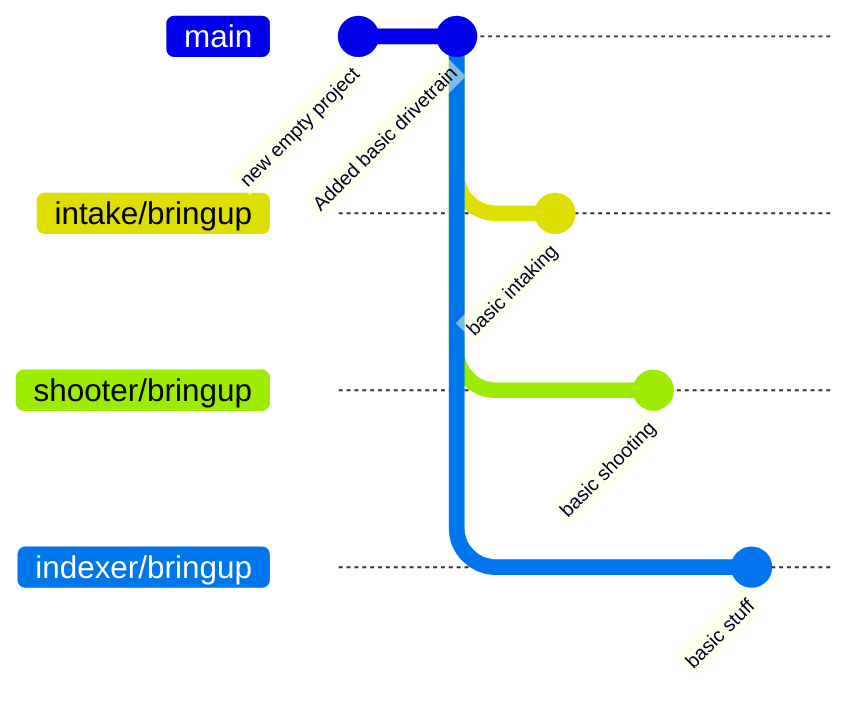

Intake and Shooter aren't done enough to merge back into main, but the indexer can't *really* be tested because you need to move it through the intake and shooter. But, you also don't want to actually do all that work yourself. 

So, just merge the `intake/bringup` and `shooter/bringup` branches! 

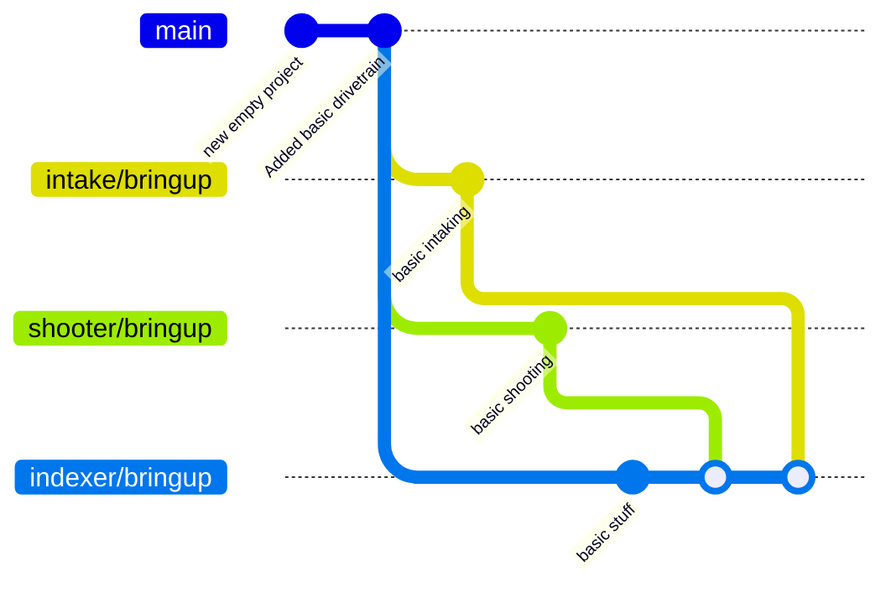

There you go! Now you can continue your work, using the preliminary work from the other branches. As they adjust and fix things, you can merge their code, and they could also merge yours into their branches before finally verifying 2 or 3 of these subsystems work properly.

There's a catch here: The branches in question might not be fully ready for you to pull them! It's always a good idea to talk to whoever's working on that code to make sure that it's in a state that's good to go. Sometimes they'll just need to adjust up one or two things, fix a variable/method name, or other times they might suggest you wait for some bigger cleanup or process fixes.
#### Merge main->Topic before Topic->main

Similar in concept to the above in some ways! By our process definitions, Main should *always* be in a good state, meaning you can pull it at any time. So, before declaring your branch Done and getting it in Main, go ahead and pull Main and test things first!

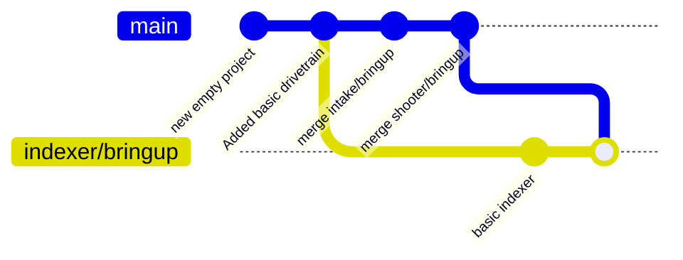
Now you can test the indexer in the full codebase without any risk of accidentally putting a bug in `main`, and any adjustments are part of the `indexer/bringup` branch like shown here

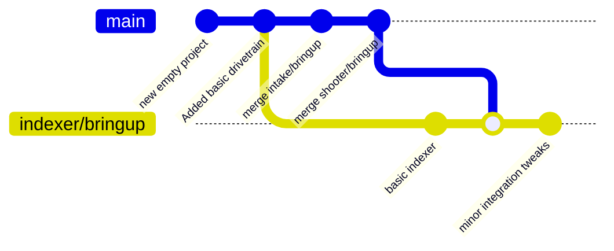

At long last, with everything fully integrated, we can finally get our changes back into main, knowing with confidence it works as expected.
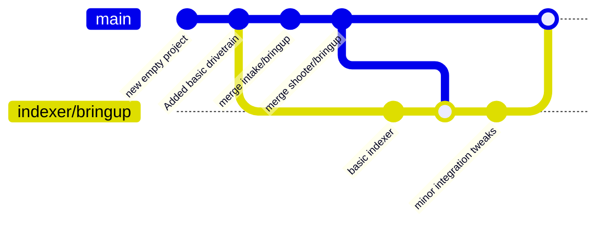