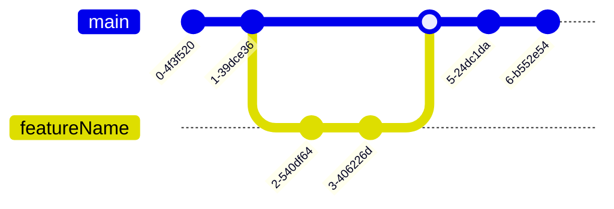
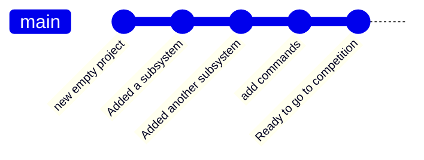
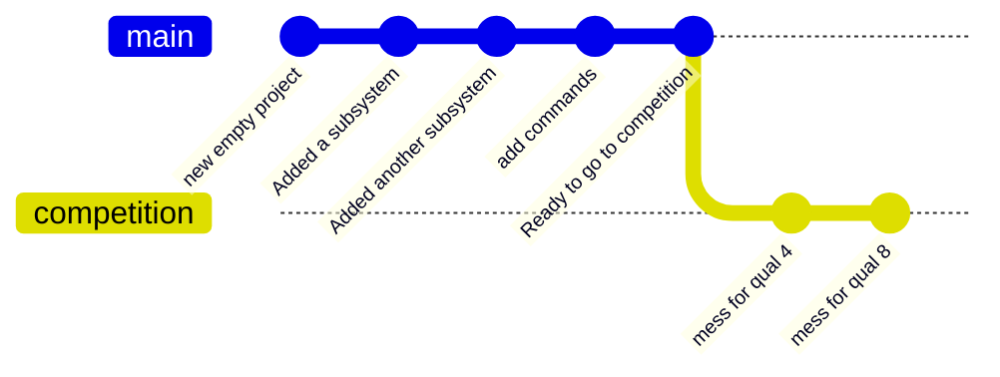
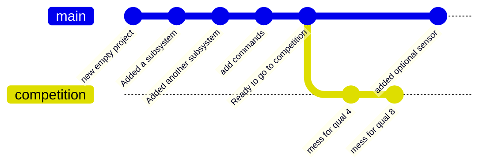
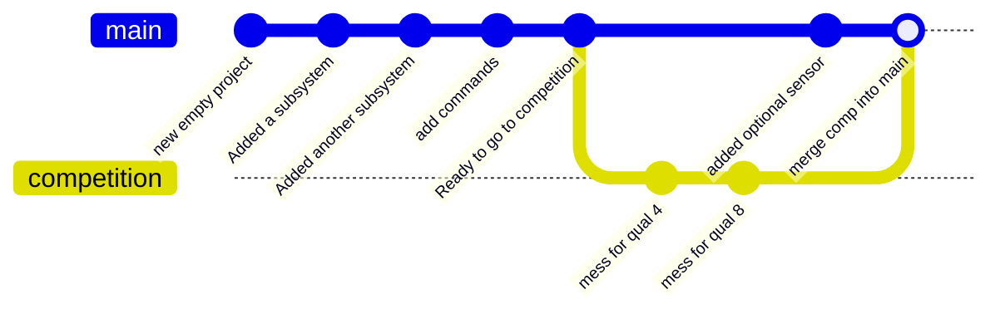
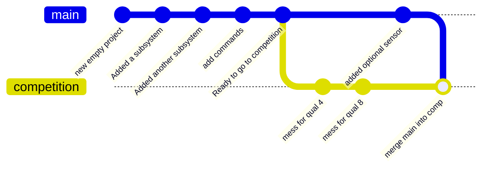
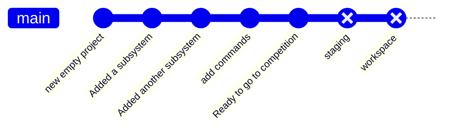

## Goals
Understand the typical Git operations most helpful for day-to-day programming

## Completion Requirements
This module is intended to be completed alongside other tasks.

- [ ] Initialize a git repository in your project
- [ ] Create an initial commit
- [ ] Create several commits representing simple milestones in your project
- [ ] When moving to a new skill card, create a new branch to represent it. Create as many commits on the new branch as necessary to track your work for this card. 
- [ ] When working on a skill card that does _not_ rely on the previous branch, switch to your `main` branch, and create a new branch to  represent that card.
- [ ] On completion of that card (or card sequence), merge the results of both branches back into Main.
- [ ] Upon resolving the merge, ensure both features work as intended.

## Topic Summary
- Understanding git
- workspace, staging, remotes
- fetching
- Branches + commits
- Pushing and pulling
- Switching branches
- Merging
- Merge conflicts and resolution
- Terminals vs integrated UI tools


In general



### Create diagrams here
https://mermaid.live/edit#pako:eNqFUM1OxiAQfJUve24aaAulXDXx5AuYXrDsR4kFGgSjNn13sZ8_ica4p9nZmdlkNpiCRpBgbLqJap1HfyozBeds-o3vo_LTfNL4hEtYP-4zTg8hpx_sHwlfaqesv1AOo8H_3FCBiVaDTDFjBcVTAsoK27tqhDSjwxFkgRrPKi9phNHvxbYqfxeC-3TGkM0M8qyWx7LlVauE11aZqL4l6DXGq5B9AkmHIwLkBs8gG8Fq3lLBeccY6QWt4KWwhNU960jXsn6ghDK-V_B6PCW1oJQ2HWt4OwhOBasAtU0h3l6KP_rf3wA0I3rV

## Git Fundamentals

Git is a "source control" tool intended to help you manage source code and other text data.

Git has many superpowers, but the basic level provides "version control"; This allows you to create "commits", which allow you to capture your code's state at a point in time. Once you have these commits, git lets you go back in time, compare to what you've done, and more. 



#### Diffs

Fundamental to Git is the concept of a "difference", or a diff for short. Rather than just duplicating your entire project each time you want to make a commit snapshot, Git actually just keeps track of what you've _changed_.

In a simplified view, updating this simple subsystem
```java
/**Example class that does a thing*/
class ExampleSubsystem extends SubsystemBase{
	private SparkMax motor = new SparkMax(1);
	ExampleSubsystem(){}
	public runMotor(){
		motor.run(1);
	}
	public stop(){/*bat country*/}
	public go(){/*fish*/}
}
```
to this
```java
/**Example class that does a thing*/
class ExampleSubsystem extends SubsystemBase{
	private SparkMax motor = new SparkMax(1);
	private Encoder encoder = new Encoder();
	ExampleSubsystem(){}
	public runMotor(double power){
		motor.run(power);
	}
	public stop(){/*bat country*/}
	public go(){/*fish*/}
}
```
would be stored in Git as 
```diff
class ExampleSubsystem extends SubsystemBase{
	private SparkMax motor = new SparkMax(1);
+	private Encoder encoder = new Encoder();
	ExampleSubsystem(){}
-	public runMotor(1){
-		motor.run(1);
+	public runMotor(double power){
+		motor.run(power);
	}
	public stop(){/*bat country*/}
```

With this difference, the changes we made are a bit more obvious. We can see precisely _what_ we changed, and _where_ we changed it.
We also see that some stuff is missing in our diff: the first comment is gone, and we don't see go or our closing brace. Those didn't change, so we don't need them in the commit. 

However, there are some unchanged lines, near the changed lines. Git refers to these as "context". These help Git figure out what to do in some complex operations later. It's also helpful for us humans just taking a casual peek at things. As the name implies, it helps you figure out the context of that change.

We also see something interesting: When we "change" a line, Git actually 
- Marks it as deleted
- Marks it as added
Simply put, just removing a line and then adding the new one is just easier most of the time. However, some tools detect this, and will bold or highlight the specific bits of the line that changed.

### Commits + Branches

Now that we have some changes in place, we want to "Commit" that change to Git, adding it to our project's history. 

A commit in git is a just a bunch of changes, along with some extra data. The most relevant is  
- A commit "hash", which is a unique key representing that specific change set
- The "parent" commit, which these changes are based on
- The actual changes + files they belong to.
- Date, time, and author information
- A short human readable "description" of the commit. 

These commits form a sequence, building on top from the earliest state of the project. We generally assign a name to these sequences, called "branches". 
 
A typical project starts on the "main" branch, after a few commits, you'll end up with a nice, simple history like this. 


It's worth noting that a branch really _is_ just a name that points to a commit, and is mostly a helpful book-keeping feature. The commits and commit chain do all the heavy lifting. Basically anything you can do with a branch can be done with a commit's hash instead! 

### Multiple Branches + Switching

We're now starting to get into Git's superpowers. You're not limited to _just_ one branch. You can create new branches, switch to them, and then commit, to create commit chains that look like this:
 


Here we can see that `mess for qual 4`  and `mess for qual 8`  are built off the `main` branch, but kept as part of the `competition` branch. This means our `main` branch is untouched. We can now switch back and forth using  `git switch main ` and `git switch competition` to access the different states of our codebase. 

We can, in fact, even continue working on `main` adding commits like normal. 


Being able to have multiple branches like this is a foundational part of how Git works, and a key detail of it's collaborative model. 

However, you might notice the problem: We currently can access the changes in `competition` _or_ `main`, but not _both at once_.  

### Merging
Merging is what allows us to do that. It's helpful to think of merging the changes from another branch into your current branch.

If we merge `competition` into `main`, we get this. Both changes ready to go! Now main can access the `competition` branch's changes. 



However, we can equally do `main` into `competition`, granting `competition` access to the changes in main. 
 


Now that merging is a tool, we have unlocked the true power of git. Any set of changes is built on top of eachother, and we can grab changes without interrupting our _existing_ code and any other changes we've been making! 

This feature powers git's collaborative nature: You can pull in changes made by other people just as easily as you can your own. They just have to have the same parent _somewhere_ up the chain so git can figure out how to step through the sequence of changes.

### Branch Convention

### Workspace, Staging, Origin

Git is a distributed system, and as such has a few different places that all these changes can live. 

The most apparent one is your actual code on your laptop, forming the workspace. As far as you're concerned, this is just the files in the directory. However, Git sees them as the culmination of all changes committed in the current branch, plus any _uncommitted_ changes. 

The next one is "staging": This is just the incomplete _next_ commit, and holes all the changes you've added as part of it. Once you properly commit these changes, your staging will be cleared, and you'll have a new commit in your tree. 

It basically looks like this:


Next is a "remote", representing a computer somewhere else. In most Git work, this is just Github. There's several commands focused on interacting with your remote, and this just facilitates collaborative work and offsite backup.  
### Handling Merge Conflicts


```diff
class ExampleSubsystem extends SubsystemBase{
	private SparkMax motor = new SparkMax(1);
+	private Encoder encoder = new Encoder();
	ExampleSubsystem(){}
-	public runMotor(1){
-		motor.run(1);
+	public runMotor(double power){
+		motor.run(power);
	}
	public stop(){/*bat country*/}
```


## The critical commands

`
`git init` :  This creates a new git repository for your current project. You want to run this in the base 
`git add <files>`


### Git from VSCode


### Other Git tools
There's a *lot* of tools that interact with your Git repository, but it's worth being mindful about which ones you pick! Many tools do unexpected 